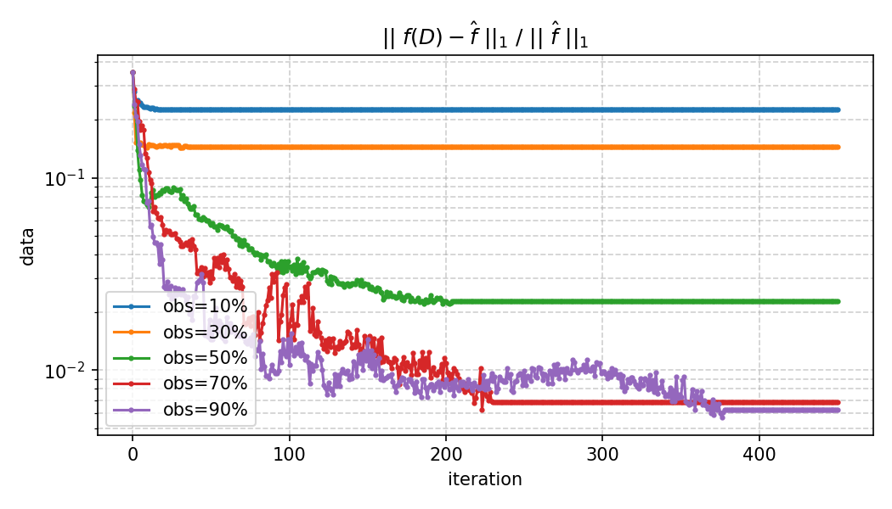
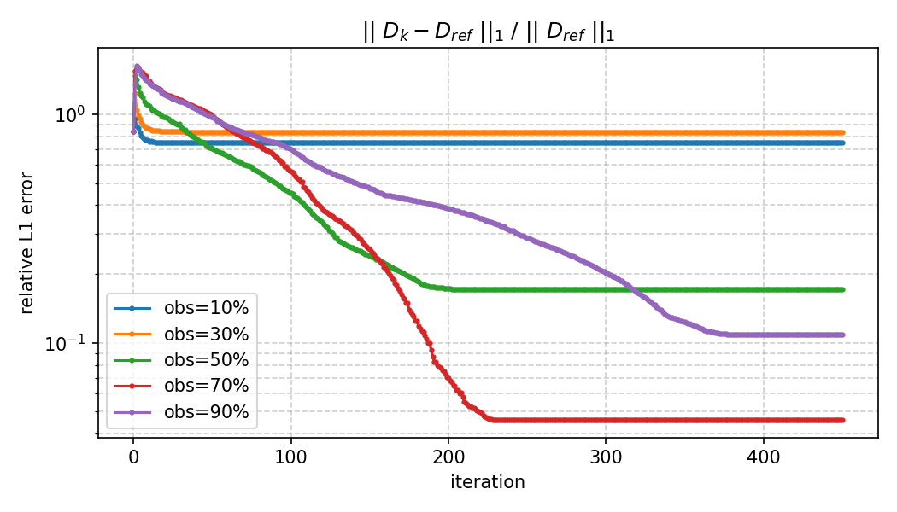
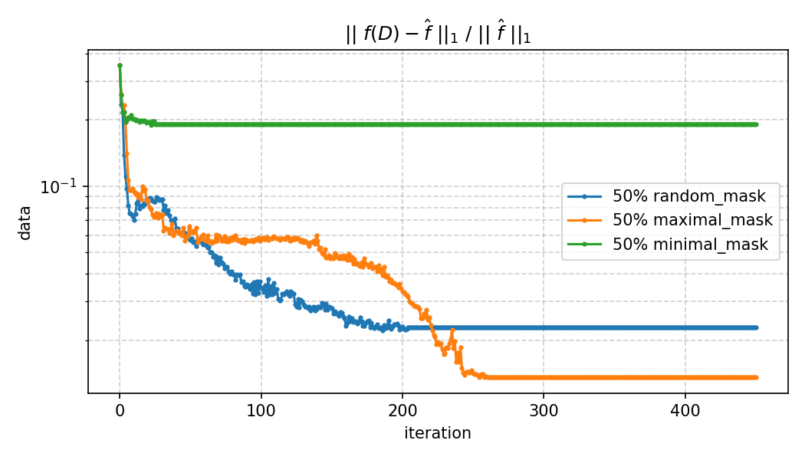
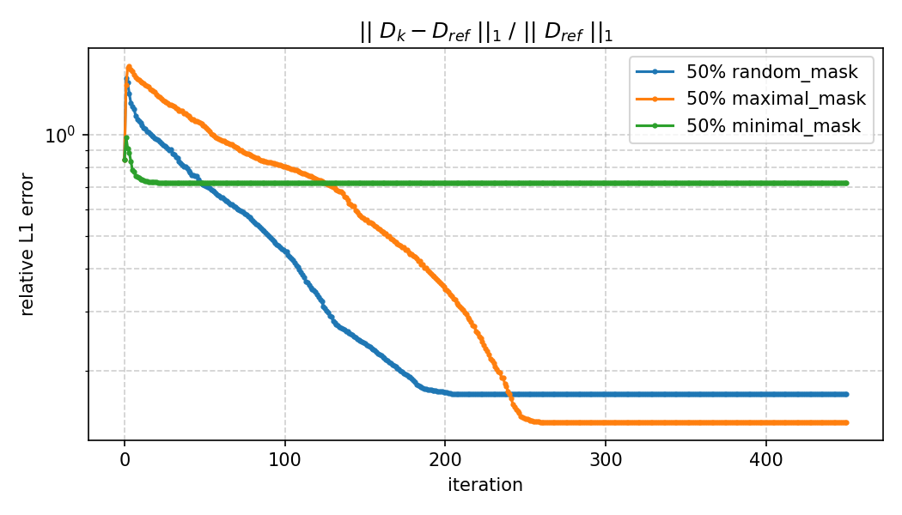
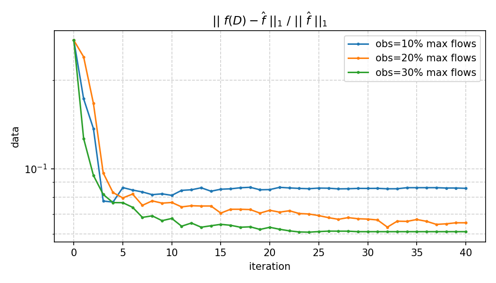
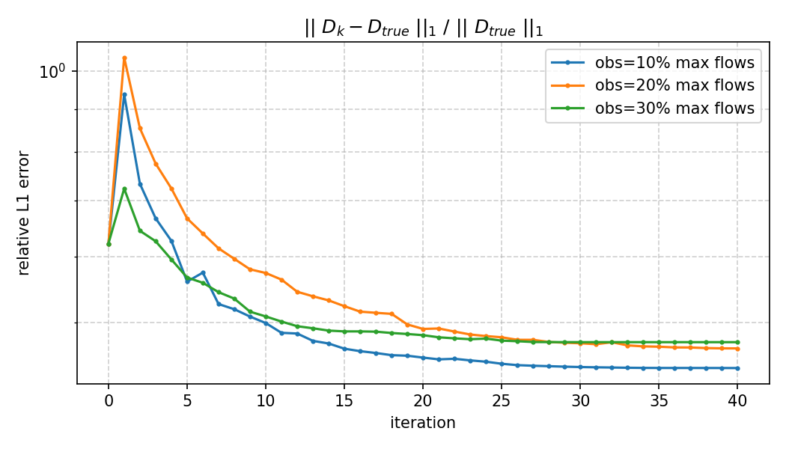
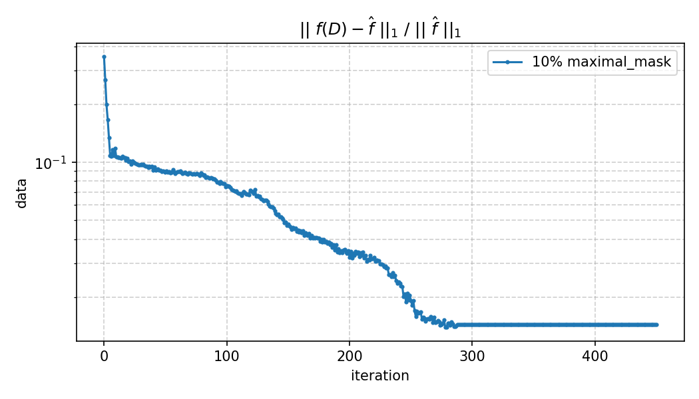
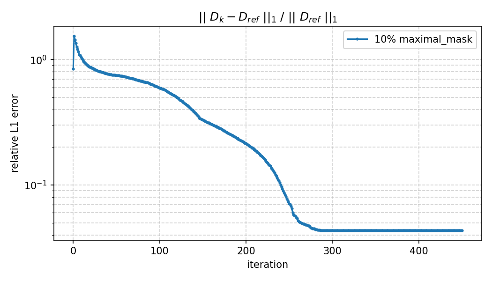

# Используемые обозначения

Далее в тексте термины "OD-матрица", "матрица спроса" и "матрица корреспонденции" обозначают одно и то же.

Транспортная сеть моделируется ориентированным графом $G=(V,E)$ на $|V|=n$ вершинах (зоны совпадают с вершинами), с числом рёбер $|E|=m$ из данных сети. Используются следующие обозначения: 

- $n$ — число зон (в эксперименте каждая зона соответствует вершине графа).
- $m$ — число рёбер.
- $D\in\mathbb{R}_+^{n\times n}$ — OD-матрица спроса, $D_{ij}\ge 0, D_{ii}=0$.
- Маргиналии (исходящие/входящие):
  $$
  L_i=\sum_{j=1}^n D_{ij},\qquad W_j=\sum_{i=1}^n D_{ij}.
  $$
- Вектор потоков на рёбрах: $f\in\mathbb{R}_+^{m}$.
- Маска наблюдений потоков: $M\in\{0,1\}^{m}$, $M_e=1$ означает, что поток на ребре $e$ наблюдается. Поэлементное умножение обозначим $\odot$.

Множество допустимых OD-матриц с фиксированными маргиналиями:
$$ч
\mathcal{D}(L,W)=\left\{D\in\mathbb{R}_+^{n\times n}:\;
D\mathbf 1=L,\; D^\top\mathbf 1=W,\; D_{ii}=0\right\}.
$$

Каждому ребру $e\in E$ сопоставляется **стоимость ребра** (далее используется используется BPR):
$$
t_e(x_e)=t^0_e\left(1+\alpha_e\left(\frac{f_e}{c_e}\right)^{\beta_e}\right),
$$
где $f_e$ — поток на ребре $e$, $c_e>0$ — пропускная способность, $t^0_e>0$ — время свободного проезда,$\alpha_e=0.15$, $\beta_e=4$ (в эксперименте одинаковы для всех рёбер).

# Постановка задачи двухуровневой оптимизации

Ищется $D\in\mathcal{D}(L,W)$, минимизирующая расхождение модельных и наблюдаемых потоков на наблюдаемых рёбрах, плюс $L_1$-регуляризация:
$$
\min_{D\in\mathcal{D}(L,W)}\;
\underbrace{\frac12\left\|M\odot\big(f(D)-\hat f\big)\right\|_2^2}_{\text{невязка по потокам}}
\;+\;
\lambda\underbrace{\left\|D-\hat{D}\right\|_{1}}_{\text{регуляризация}},
$$

где $\lambda\ge 0$ — вес регуляризации, $\hat{f}$ -- экспериментальные значения потоков, $\hat{D}$ -- априорная матрица корреспонденции (может быть получена по модели или экспериментально), $f(D)$ -- решение задачи Бэкмана о равновесном распределении нагрузки на транспортную сеть.

# Численный алгоритм

## Модель Бэкмана

Для фиксированного спроса $D$ потоки $f(D)$ определяются как решение задачи равновесного назначения (Wardrop UE), которая в случае с приведённой $t_e(f)$ может быть переписана в терминах минимазции потенциала:
$$
\min_{f\in\mathcal{F}(D)}\;\Phi(f)\;=\;\sum_{e\in E}\int_0^{f_e} t_e(s)\,ds,
$$
где $\mathcal{F}(D)$ — множество потоков, реализуемых некоторым разбиением спроса $D$ по путям (стандартные ограничения сохранения потоков/спроса).

Градиент потенциала по потокам имеет простой вид:
$$
\nabla_f \Phi(f)=t(f)\in\mathbb{R}^m,\qquad [t(f)]_e=t_e(f_e).
$$

## Метод Франк—Вульфа

1. Инициализация: $f^{(0)}=$ распределение потоков по полю стоимости $t_e^0$ (то есть в ненагруженной сети).
2. На итерации $k$:
   - вычисляются текущие времена $t^{(k)}=t\!\left(f^{(k)}\right)$;
   - решается линейная подзадача
     $$
     y^{(k)}\in\arg\min_{y\in\mathcal{F}(D)}\langle t^{(k)},y\rangle,
     $$
     что можно переформулировать как "для каждого origin $o$ весь спрос $D_{o\cdot}$ отправляется по кратчайшим путям (по весам $t^{(k)}$) к каждому destination $d$"
   - обновления состояния:
     $$
     f^{(k+1)}=(1-\gamma_k)f^{(k)}+\gamma_k y^{(k)},\qquad \gamma_k=\frac{2}{k+2}.
     $$

Итоговая аппроксимация равновесного потока:
$$
f(D)\approx f^{(K)},
$$
где $K$ -- это гиперпараметр числа итераций.

## Адаптивный метод зеркального спуска для решения внешней задачи оптимизации

Для решения внешней задачи мы выбрали метод зеркального спуска с энтропийной геометрией для восстановления матрицы корреспонденций
$D\in\mathbb{R}_+^{n\times n}$ по наблюдаемым потокам $\hat f$ в модели Бекмана. Рассматривается задача
$$
F(D)=\frac12\|M\odot(f(D)-\hat f)\|_2^2+\lambda\|D-D_\mathrm{prior}\|_1,
$$
где $f(D)$ есть решение задачи Бекмана, $M$ $-$ маска наблюдаемых ребер, $\lambda\ge 0$.

Оптимизация ведётся на множестве матриц с фиксированными маргиналиями и нулевой диагональю:
$$
\mathcal{D}(L,W)=\{D\in\mathbb{R}_+^{n\times n}:\; D\mathbf{1}=L,\; D^\mathsf{T}\mathbf{1}=W,\; D_{ii}=0\}.
$$

### Зеркальный шаг как $\arg\min$

Пусть на итерации $k$ доступен (суб)градиент $G^k\in\partial F(D^k)$. Итоговый зеркальный шаг определяется решением подзадачи
$$
D^{k+1}\in\arg\min_{D\in\mathcal{D}(L,W)}
\left\{\langle G^{k},D\rangle+\frac{1}{\eta_k}\,\mathrm{KL}(D\|D^{k})\right\},
$$
где $\eta_k>0$ и
$$
\mathrm{KL}(D\|D^{k})=\sum_{i\ne j}\left(D_{ij}\log\frac{D_{ij}}{D^{k}_{ij}}-D_{ij}+D^{k}_{ij}\right).
$$

---

### Формула для шага без ограничений на маргиналии

Для вывода явной формулы временно уберем линейные ограничения на маргиналии, оставив только
$$
D_{ij}\ge 0,\qquad D_{ii}=0.
$$
Тогда вспомогательная задача имеет вид
$$
\tilde D^{k+1}\in\arg\min_{D\ge 0,\;D_{ii}=0}
\left\{\sum_{i\ne j} G^k_{ij}D_{ij}+\frac{1}{\eta_k}\sum_{i\ne j}
\left(D_{ij}\log\frac{D_{ij}}{D^k_{ij}}-D_{ij}+D^k_{ij}\right)\right\}.
$$

**Условия Каруша-Куна-Таккера (для $i\ne j$).** Для ограничений $D_{ij}\ge 0$ вводятся множители $\nu_{ij}\ge 0$.
Стационарность лагранжиана по прямым переменным даёт
$$
G^k_{ij}+\frac{1}{\eta_k}\log\frac{D_{ij}}{D^k_{ij}}-\nu_{ij}=0,
$$
а также выполняется условие дополняюшей нежёсткости $\nu_{ij}D_{ij}=0$ и ограничения $D_{ij}\ge 0$.
При внутреннем решении $D_{ij}>0$ имеем $\nu_{ij}=0$, поэтому
$$
G^k_{ij}+\frac{1}{\eta_k}\log\frac{D_{ij}}{D^k_{ij}}=0
\quad\Rightarrow\quad
\tilde D^{k+1}_{ij}=D^k_{ij}\exp\!\big(-\eta_k G^k_{ij}\big),\quad i\ne j,
$$
и $\tilde D^{k+1}_{ii}=0$.

Таким образом, экспоненциальная формула шага в зеркальном спуска является аналитическим решением *неограниченного* KL-prox промежуточного шага (без маргиналий); в общем случае $\tilde D^{k+1}\notin\mathcal{D}(L,W)$.

---

### Восстановление маргиналий как KL-проекция (IPF)

Полный constrained-шаг получается KL-проекцией промежуточной матрицы $\tilde D^{k+1}$ на $\mathcal{D}(L,W)$:
$$
D^{k+1}\in\arg\min_{D\in\mathcal{D}(L,W)}\mathrm{KL}(D\|\tilde D^{k+1}).
$$
Эта проекция реализуется процедурой IPF (iterative proportional fitting), то есть попеременным масштабированием строк и столбцов до заданных маргиналий при сохранении $D_{ii}=0$.

В реализации используется маска "обнуления" диагонали; умножение на такую маску выполняется **после каждого** масштабирования строк и столбцов. Поэтому ограничение $D_{ii}=0$ является инвариантом IPF и не требуется отдельного “обнуления диагонали” после проекции (которое действительно нарушило бы маргиналии).

### Подбор шага $\eta_k$ (backtracking line search)

Для большей робастности алгоритма предлагается сделать его адаптивным. При заданном $\eta$ строится кандидат
$$
\tilde D = D^k\odot\exp(-\eta G^k),\qquad
D_\mathrm{cand}=proj(\tilde D),
$$
где $proj(\cdot)$ обозначает описанную выше IPF проекцию. Если выполняется убывание
$$
F(D_\mathrm{cand})<F(D^k)-\varepsilon_\mathrm{imp},
$$
то шаг принимается; иначе $\eta\leftarrow\beta\eta$ для некоторого $\beta\in(0,1)$ и попытка подбора шага повторяется.

## Расчет градиента потоков по матрице корреспонденции

Обозначим невязку на наблюдаемых рёбрах:
$$
r(D)=M\odot\big(f(D)-\hat f\big)\in\mathbb{R}^m.
$$

Тогда градиент квадрата невязки потоков по матрице $D$, вытянутой в вектор, выражается через Якобиан
$$
J(D)=\frac{\partial f(D)}{\partial\,\mathrm{vec}(D)}\in\mathbb{R}^{m\times n^2}:
\qquad
\nabla_D\frac12\|r(D)\|_2^2=\mathrm{unvec}\!\big(J(D)^\top r(D)\big).
$$

Мы будем приближать $J(D)$ при помощи рекурсивной формулы, котрая следует из алгоритма решения задачи Бэкмана -- метода Франк-Вульфа.

При фиксированных весах $t^{(k)}$ нагрузка на каждой итерации метода линейна по $D$ (так как решатеся задача ЛП на множестве). Тогда можно представить зависимость потоков о матрицы корреспонденции как:
$$
f^{(k)}=A(t^{(k)})\,\mathrm{vec}(D),
$$
где матрица маршрутизации $A(t^{(k)})$ имеет элементы
$$
[A(t^{(k)})]_{e,(o,d)}=
\begin{cases}
1,& \text{если ребро $e$ лежит на выбранном кратчайшем пути $o\to d$ при весах }t^{(k)},\\
0,& \text{иначе.}
\end{cases}
$$

Если рассматривать веса $t^{(k)}$ как «замороженные», то Якобиан итерации метода удовлетворяет рекурсии:
$$
G^{(0)}=0,\qquad
G^{(k+1)}=(1-\gamma_k)G^{(k)}+\gamma_k A(t^{(k)}),
$$
$$
J(D)\approx G^{(K)},\qquad
\nabla_D\frac12\|r\|^2\approx \mathrm{unvec}\!\big((G^{(K)})^\top r\big).
$$

Замечание: такой вывод имеет место быть, если при заданной нагрузке $t_e(f(D^k))$ при всех k не существует двух кратчайших путей на графе сети (то есть с одинаковой стоимостью). Если такое всё же имеет место, то функция становится не дифференцируемой. Все же предполагается, что вектор, получаемый до заданному алгоритму является элементом субдифференциала даже в такой точке.

# Генерация синтетических наблюдений потоков

Пусть задана «истинная» матрица корреспонденций $D_\mathrm{true}$.

## Генерация референсных значений для функционала оптимизации
$$
\hat{f}=f(D_\mathrm{true}), \quad \hat{D} = proj(D_{true} * (1 + \xi)),
$$
где $\xi$ -- некоторая случайная матрица, моделирующая шум в данных или неточность модели, по которой строится референс $\hat{D}$, а $proj(\cdot)$ -- проекция на маргиналии.

## Выбор начального приближения для зеркального спуска

Стартовая точка $D^{(0)}$ строится из референса $D_\mathrm{ref}$ через SVD и эвристическую модификацию сингулярных значений. Это сделано с целью контролируемого изменения точности начального приближения (это удобно для проведения экспериментов).
$$
D_\mathrm{ref}=U\,\mathrm{diag}(\sigma)\,V^\top,\qquad
\widetilde D = U\,\mathrm{diag}(\widetilde\sigma)\,V^\top,
$$
где $\widetilde\sigma$ получается из $\sigma$ некоторой модификацией (в экспериментах заменяется главное сингулярное число).

Далее $\widetilde D$ приводится в допустимое множество:$D^{(0)}=proj(\max(\widetilde D,0)\bigr)$,
то есть выполняется проекция на заданные маргиналии $(L,W)$ методом IPF с обнулением диагонали.

#  Численные эксперименты

Численные эксперименты проводились на графе и матрицы корреспонденции SiouxFalls. Данные расположены по ссылке ([SiouxFalls](https://raw.githubusercontent.com/bstabler/TransportationNetworks/master/SiouxFalls/)).

## Гиперпараметры алгоритма

- **Наблюдения потоков:** доля наблюдаемых рёбер $p$; зерно генерации маски $M$; уровень шума $\sigma$ и зерно генерации шума.
- **Регуляризация:** вес $\lambda$ у L1-регуляризатора $\|D-D_\mathrm{true}\|_{1}$ (в большинстве запусков используется $\lambda=5\cdot 10^2$).
- **Метод Франк-Вульфа:** максимум итераций $K=200$; убывающий шаг $\gamma_k=2/(k+2)$.
- **Зеркальный спуск:** число внешних итераций (используется разное кол-во); максимум итераций бектрекинга $50$; IPF-проекция имеет не более $T=30$ внутренних итераций.

##  Референсная матрица $D_{ref}$ совпадает с $D_{true}$

В текущем эксперименте предполагалось, что $\hat{D} = D_{true}$. При этом так как потоки $\hat{f} = f(D_{true})$, то решением задачи является $D = D_{true}$. В данном эскперименте проверяется сходимость к этому значению. Стоит сразу оговорится, что функция, которую мы оптимизируем не является выпуклой, и метод находит некоторый локальный минимум, в котором и застревает. Численный эксперименты показали, что несмотря на это качество матрицы корреспонденции остается приемлемым.

### Вариация количества наблюдаемых потоков на случайных рёбрах

В данном эсперименте изменялось количество наблюдаемых потоков (формально: изменялось коилчество нулей и единиц в маске $M$). При этом выбор потоков, на который смотрим был случайным, но таким, что выполнение включение маски с меньшим количеством потоков в маску с большим количеством потоков (то есть маски "расширяются"). Ниже приведены графики для относительной разницы потоков и матрицы корреспонденции с соотвествующими референсами.

На графиках видна тенденция: чем больше поток наблюдается, тем лучше качество восстановления матрицы коррепонденции. При этом сама матрицы (в терминах $L_1$ нормы) восстанавливается хуже.

###  Вариация выбора конкретных рёбер для лучшего качества восстановления

В данном эксперименте исследовалась зависимость качества восстановления матрицы корреспонденции от тех рёбер, на которых компоненты $\hat{f}$ считались известными. Сравнивались три сценария: 50% максимальных по модулю компонент, 50% минимальных по модулю компонент и 50% случайных компонент вектора $\hat{f}$. Ниже приведены графики сравнения качества восстановления матрицы.

Из графика видна тенденция: чем больше компоненты наблюдаемых потоков, тем лучше точность восстановления.

## Референсная матрица $D_{ref}$ не совпадает с $D_{true}$

Теперь зашумим референсную матрица $D_{ref}$ на 20% относительно $D_{true}$.

### Вариация выбора топ $p$ рёбер для лучшего качества восстановления

В данном эксперименте выбираются различные количества индексов с максимальными по модулями компонентами в вектора $\hat{f}$.

Этот график подверждает выводы пункта 5.2.1.

### Расчет по рёбрам с 10% максимальными потоками

Теперь проведем "боевой эксперимент". Начальное приближение не генерировалось с помощью сингулярного разложения, а бралось в виде $D^0 = D_{true} * (1 + noise)$. В данном эскпемиремне относительная $L1$ норма отсносительно $D_{true}$ была 0.2. Матрицы $D_{ref}$ относительно также зашумлялась, относительная ошибка была 0.2. Графики сходимости приведены ниже.

На таких данных алгоритм дает восстановление потоков (а значит и качество матрицы) на уровне 0.015. 

## Вопросы без ответа и идеи

1. Какое качество будет у матрицы на построенной по какой-либо модели (гравитационная, энтропийная). Будет ли оно уже достаточно хорошим? И нужна ли вообще оптимизация тогда?

2. Вывод рекурсии для градиента не является верным даже в точке, где функция дифференцируема, если функциональная последовательность, генерируемая методом Франк-Вульфа не является равномерно сходящейся. Это не исследовалось, но ощущение есть, что все же она не равномерно сходится...

3. Если в алгоритме отключить регуляризацию вовсе, то резульатом будет некоторая матрица, которая отличается от исходной на 0.8 по относительной ошибке, при этом точность восстановления потоков около 0.05 при использовании 50% потоков. Это победа?